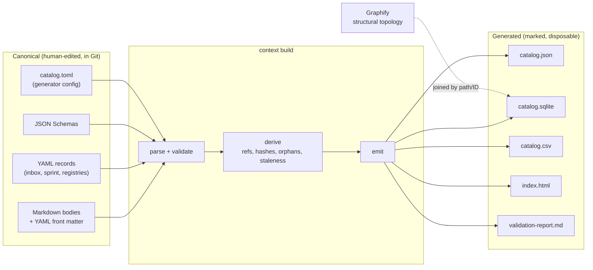

# Context catalog design

> **Status:** PROPOSAL for founder review. No catalog has been built and no tooling installed.
> **Governing sources:** Slops OS #14 (catalog amendment), #15 (Direction indexing), Omen #278 (Omen-local fallback).
> **Codex coverage:** none. `sqlite` and `FTS5` appear zero times in the entire Codex package.
> This is net-new architecture, not a revision.

## 1. Principle

Article 12: canonical Markdown and human-edited front matter are authored once. Everything else is a
**generated view** — reproducible, marked, and safe to delete. Deleting every generated output must lose
exactly zero knowledge.

The test: `rm -rf References/context-catalog/ && context build` must restore the system to byte-identical
state. If it cannot, something canonical leaked into a generated artifact and that is a defect.

## 2. Pipeline



## 3. Canonical inputs

| Input | Role |
| --- | --- |
| Markdown bodies + YAML front matter | The knowledge itself and its authored metadata |
| YAML records (`.yml`) | Human-edited structured data — inbox items, sprint records, controlled vocabularies, tool-capability manifests — where prose would be worse |
| JSON Schemas | Validation contracts for metadata and Direction records |
| `catalog.toml` | The **only** justified TOML. Holds: repository roots and aliases, include/exclude globs, which paths require which metadata level, output destinations, validation strictness. It is genuinely tool configuration, benefits from comments, and is read by machines only — the amendment's exact test for TOML. Python reads it with stdlib `tomllib`. |

Nothing else is TOML. No knowledge is authored in JSON, CSV, HTML, or SQLite.

## 4. Generated outputs

All land in `References/context-catalog/`, which Codex's target tree already reserves as a
non-authoritative home for generated maps.

| Output | Consumer | Why it exists |
| --- | --- | --- |
| `catalog.json` | Agents, scripts, other tools | Portable, diffable, greppable. The interchange format. |
| `catalog.sqlite` | Local query CLI, agents needing search | Relationship traversal and full-text ranking that JSON cannot do without loading everything. |
| `catalog.csv` | Founder bulk review in a spreadsheet | The 384-file triage bucket is far easier to classify in a grid than in prose. This is the format that makes the migration tractable. |
| `index.html` | Founder browsing | Self-contained, no CDN, offline. Filter by type/status/authority/scope; click through relationships. |
| `validation-report.md` | Founder + CI | Blocking errors and warnings, separately. |

Every generated file carries a provenance header:

```yaml
generated: true
generator: context-build
generator_version: 0.1.0
generated_at: 2026-08-04T12:00:00Z
source_commit: <sha>
source_content_hash: <sha256 of the sorted canonical input hashes>
authority: generated
warning: Generated file. Do not hand-edit. Regenerate with `context build`.
```

`source_content_hash` is what makes staleness detectable without trusting mtimes — which is essential
here, because Git does not preserve mtimes and a fresh clone would otherwise report everything stale.
**Recommendation: content-hash staleness, never mtime.**

For SQLite and HTML the same fields live in a `catalog_meta` table / `<meta>` block respectively.

## 5. Required behavior

From #14, #15, and #278, the catalog must support:

| Capability | Mechanism |
| --- | --- |
| Stable ID lookup | `documents.id` primary key |
| Alias resolution | `aliases` table; any alias → canonical record; two records claiming one alias is a blocking error |
| Metadata filtering | Indexed columns: repository, artifact_type, status, authority, owner |
| Authority ranking | Order by authority rank, then status rank — *never* by date. Article 3 as a query, not a convention. |
| Status filtering | Default query excludes `superseded` and `archived` unless history is explicitly requested |
| Supersession detection | `relationships` walk on `supersedes` / `superseded_by`; returns the current head of a lineage |
| Relationship traversal | Single `relationships(from_id, type, to_id)` table; recursive CTE for transitive queries |
| Orphan detection | Active artifacts with zero inbound references and no `governed_by` |
| Duplicate-authority detection | Two `authority=authoritative, status IN (active, accepted)` records sharing a scope → blocking error |
| Stale-review reporting | `review_after < today`, or `last_reviewed` older than the type's cadence |
| Reproducibility | Deterministic ordering, content hashes, no timestamps in the data rows |

The Direction acceptance tests from #15 map to plain queries — active sprint items for Omen; blocked work
with unresolved dependencies; accepted decisions affecting iOS onboarding; inbox items lacking required
Blueprints; the current replacement for a superseded ID; the latest closure; authoritative state records
not reviewed recently. **All seven are single-table or single-join queries under this design.** That is
the acceptance bar and it is met.

## 6. Toolchain — verified, not assumed

Measured on this machine:

```text
Python 3.14.3   sqlite3 present, SQLite 3.50.4, FTS5 compiles OK
                PyYAML present · tomllib present (stdlib) · csv, json, hashlib, sqlite3 stdlib
Node 24.11.0    npm present
git 2.54 · gh 2.92 · ripgrep 15.1
NOT present:    sqlite3 CLI · jq · jsonschema (Python module)
```

Consequences:

- **`catalog.json`, `catalog.sqlite`, `catalog.csv`, `index.html`, content hashing, front-matter parsing,
  and TOML config all require ZERO new dependencies.** Python's standard library plus the already-present
  PyYAML covers the entire build.
- **The only gap is JSON Schema validation** (`jsonschema` is not installed). Three options:
  1. `pip install jsonschema` — small, pure Python, widely used. **Recommended.**
  2. Node + `ajv` — adds a `package.json` to Slops OS, which currently has none. Heavier.
  3. Hand-rolled validation — no new dependency, but re-implements a solved problem and will drift from
     the schemas. Not recommended.
- The missing `sqlite3` CLI does **not** matter; Python's module is the actual interface. Worth noting so
  nobody adds an unnecessary install.

**Recommend Python.** It reaches every required output with one small dependency, and Slops OS has no
Node toolchain today. Note this is a *change of language* from Codex's Node `build-inventory.mjs` — see
§9 for how that work is preserved rather than discarded.

## 7. `context health`

One command, exit non-zero on any blocking error.

**Blocking errors** (migration cannot proceed): invalid metadata against schema; duplicate IDs; an alias
resolving to two records; broken relationship targets; two authoritative active records claiming one
scope; a superseded document still routed as current; generated output whose `source_content_hash` no
longer matches its inputs.

**Warnings** (visible, non-blocking): broken local links; stale reviews past `review_after`; missing
review dates where the type requires them; orphaned active files; executed one-time prompts still in
active paths; oversized root wrappers past a configured byte budget; cross-repository mirror drift
(Omen's derived Keystone summary vs the canonical Constitution hash); unowned artifacts.

A single health *score* may be displayed, but **blocking errors are always listed separately and
never averaged into it.** A green score hiding a duplicate-authority error would defeat the purpose.

## 8. Graphify — division of labor

Both are generated and neither is canonical. They answer different questions:

| Catalog | Graphify |
| --- | --- |
| Deliberate, human-asserted semantics: authority, lifecycle, ownership, supersession | Discovered structure: imports, links, file references, workspace topology |
| "What governs this decision?" | "What code actually references this module?" |
| Wrong only if a human asserts something wrong | Wrong only if the scan is stale |

They join on path and ID. Graphify becomes a *column* in the catalog (structural in/out degree,
community) rather than a competing map.

**Current Graphify state is not usable as evidence.** Codex found Omen's tracked graph records a build
commit absent from the object database, 28 of 370 source paths missing, no mobile sources at all, and a
hard-coded old machine path in `.graphify_root`. Independently confirmed: `omen/graphify-out/` is
**186 tracked files, 7.3 MB, and not gitignored** — a generated cache committed as if canonical, which
is a direct Article 12 violation.

**Recommendation: untrack and gitignore `graphify-out/`, do not delete the working copy.** Codex's
inventory marks these 181 files `DELETE`; the safer equivalent action is `git rm --cached` plus a
`.gitignore` entry, which removes the false authority and 7.3 MB from history-going-forward without
destroying a local artifact. Regeneration is deferred until target paths are approved — regenerating
against paths that are about to change would waste the run.

## 9. Omen independent-clone mode

Omen must work with no Slops OS on disk (#278).

- `context build --repo omen` produces an **Omen-only catalog** from Omen's own metadata, written to
  `omen/References/context-catalog/`. Complete for all Omen-owned artifacts.
- Cross-repository references to Slops OS IDs remain in the data as **unresolved-but-recorded** — the ID
  and relationship type are preserved, marked `external: true`, and simply do not resolve to a body.
  They are never dropped, so the graph stays truthful.
- `context build --workspace` from Slops OS builds the joined catalog covering both repos and resolves
  those references.

**The generator itself must live in Slops OS** (it is shared governance tooling) with Omen able to invoke
it. Simplest workable answer for v1: Omen vendors a small, generated, hash-tracked copy of the builder
under `omen/scripts/context/`, marked generated with its source ID — the same derived-artifact pattern
used for the Keystone summary, so drift is detectable by the same check. This avoids a submodule, avoids
publishing a package, and keeps Omen's build independent.

**Nothing in Omen's `package.json`, CI, Docker, or deploy may invoke the catalog.** It is agent-facing
tooling only.

## 10. Non-goals for v1

Explicitly out of scope, per Article 10 and the amendment's deferral list: remote database service,
vector database, embeddings, semantic search, large ontology, custom CMS, autonomous governance, an
elaborate web application, real-time indexing, or a hosted knowledge service.

Version one is a script that reads files and writes five outputs. It should stay that way until a
specific retrieval failure proves it insufficient.

## 11. Decisions requested

1. **Approve the five generated outputs** and `References/context-catalog/` as their home.
2. **Approve Python + one dependency (`jsonschema`)** as the toolchain, superseding Codex's Node script
   as the *catalog* implementation while preserving its inventory logic (§9 of the disposition table).
3. **Approve content-hash staleness** over mtime.
4. **Approve `catalog.toml`** as the single justified TOML file.
5. **Authorize untracking `omen/graphify-out/`** (`git rm --cached` + gitignore, no deletion), and
   defer Graphify regeneration until target paths are approved.
6. **Confirm** blocking errors are never hidden behind a health score.
