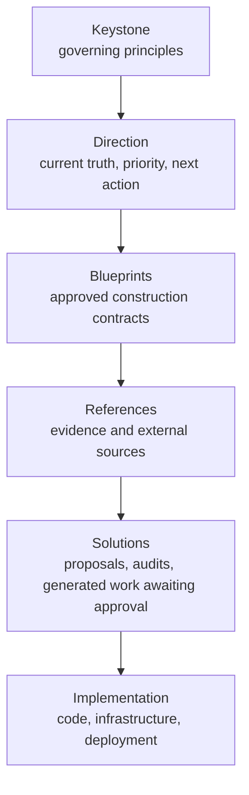

# The Keystone — proposed governing knowledge layer

> **Status:** PROPOSAL for founder review. Nothing in `Blueprints/Keystone/` has been created.
> This document proposes the layer; it does not install it.
> **Governing sources:** Slops OS #14 (Keystone amendment), Slops OS #15 (Direction alignment), Omen #278 (inheritance).

## 1. Placement decision

`Blueprints/Keystone/` is **new and collides with nothing.** Today `Blueprints/` contains only
`agent-modules/`, `agents/`, `handoffs/`, `patterns/`, `playbooks/`, `prompts/`, `skills/`, `specs/`,
`templates/`, `tools/`, plus `README.md` and `RESOURCES_INDEX.md`. There is no governance folder and
no existing home for principles.

**This supersedes Codex's proposal.** `target-trees.md` proposed `Blueprints/governance/` for this slot.
That was a reasonable guess made before the Keystone amendment existed. The amendment names the layer
normatively, so `Blueprints/governance/` should be **renamed to `Blueprints/Keystone/`** and adopt the
document set below. Same slot, correct name, no additional structure.

### What it displaces

Nothing is deleted. The relationship to the current de-facto doctrine layer is:

| Today | After |
| --- | --- |
| `Blueprints/agent-modules/` (17 files) holds the doctrine that root `CLAUDE.md` chains through — identity, layer rules, action posture, hard prohibitions, session handoff, graphify hook. | Remains, but becomes a **consumer** of the Keystone. Principles move up to Keystone; agent-modules keep only runtime-adapter mechanics. |
| Root `manifesto.md` **and** `Direction/manifesto.md` both exist — duplicate founder doctrine. | Founder intent is reconciled once; the durable principles land in the Keystone, the historical text is archived with lineage. |
| `DBS_INDEX.md` mixes boundary rules with workstation paths. | Boundary rules become a Keystone/Blueprint contract; workstation paths are dropped. |

## 2. What the Keystone is — and is not

**It is** the small set of durable rules governing how knowledge is created, identified, validated,
related, retrieved, superseded, and evolved across Slops OS, Omen, and future Valor Ventures products.

**It is not** a document bucket. Three exclusion tests, applied on every proposed addition:

1. **Would it change when a product decision changes?** → Not Keystone. That is Direction or Blueprints.
2. **Does it describe a specific tool, script, schema field, or table?** → Not the Constitution.
   It may be a supporting Keystone Blueprint, or it belongs in `Blueprints/schemas/` or `Blueprints/tools/`.
3. **Is it Omen-specific?** → Never Keystone. The Keystone must be inheritable by a product that does
   not exist yet.

### Hierarchy

Authority flows **down**. A lower layer may never contradict a higher one; when it does, that is a
validation failure, not a judgment call for the reading agent.

## 3. Proposed document set

Sized against Article 10 (Progressive Complexity). **Four documents are required for DBS vNext.
Five are deferred** until a real problem demands them — creating nine documents on day one to hold
principles for a one-founder system would itself violate Article 10.

| # | Document | Stable ID | Authority | Required? | Why it exists |
| --- | --- | --- | --- | --- | --- |
| 1 | `Constitution.md` | `SLOPS-KEYSTONE-CONSTITUTION-001` | authoritative | **v1** | The 12 articles. Short, stable, implementation-independent. The one document every agent may be told to read in full. |
| 2 | `Metadata-Standard.md` | `SLOPS-KEYSTONE-METADATA-001` | authoritative | **v1** | Field definitions, metadata levels, controlled vocabularies, ID and alias policy. The Constitution says identity is stable; this says what a field is named and what values it may take. |
| 3 | `Artifact-Lifecycle.md` | `SLOPS-KEYSTONE-LIFECYCLE-001` | authoritative | **v1** | Status values, legal transitions, supersession rules, archival rules. Directly required by Articles 5 and 7. |
| 4 | `Amendment-Log.md` | `SLOPS-KEYSTONE-AMENDMENTS-001` | authoritative | **v1** | Append-only record of constitutional changes. Required by the amendment process itself — without it the Constitution cannot legally change. |
| 5 | `Authority-Hierarchy.md` | `SLOPS-KEYSTONE-AUTHORITY-001` | authoritative | **deferred** | Conflict-resolution precedence. **Fold into Constitution Article 3 + `Metadata-Standard.md` for v1.** Promote to its own document only when a real precedence dispute cannot be settled by Article 3 alone. |
| 6 | `Retrieval-Architecture.md` | `SLOPS-KEYSTONE-RETRIEVAL-001` | authoritative | **deferred** | The metadata-first retrieval contract. For v1 this lives in `context-catalog-design.md` as a Solution; it becomes a Keystone Blueprint once the catalog is built and proven. |
| 7 | `Validation-Architecture.md` | `SLOPS-KEYSTONE-VALIDATION-001` | authoritative | **deferred** | Same reasoning: Codex's `validation-plan.md` already covers this as a Solution. Promote after the validator exists. |
| 8 | `Design-Principles.md` | `SLOPS-KEYSTONE-DESIGN-001` | supporting | **deferred** | Risks becoming a philosophy essay that duplicates the Constitution. Only create it if a principle is needed that is genuinely not constitutional. |
| 9 | `Knowledge-System-Roadmap.md` | `SLOPS-KEYSTONE-ROADMAP-001` | supporting | **deferred** | A roadmap is *current planning state* — that is Direction's job, not the Keystone's. Recommend it live in `Direction/` permanently and never enter the Keystone. |

**Recommendation:** ship 4 documents. Revisit 5–7 after the catalog and validator exist; they are
promotions of proven Solutions, not speculative authoring. Drop 9 from the Keystone entirely.

### Per-document contract (the four v1 documents)

**`Constitution.md`** — Contains: the 12 articles, the amendment process, a version number.
Does not contain: field names, file paths, tool names, table schemas, vocabularies, or any example
drawn from Omen. Lifecycle: `active`, changed only by recorded amendment. Governs: everything below it.

**`Metadata-Standard.md`** — Contains: every metadata field with type and meaning; the three metadata
levels (full / reduced / none) and which artifact types get which; controlled vocabularies for
`artifact_type`, `status`, `authority`; the ID grammar; the alias policy for preserving existing IDs.
Does not contain: JSON Schema files (those are generated artifacts in `Blueprints/schemas/`), or
retrieval logic. Lifecycle: `active`, versioned via `schema_version`. Governs: all front matter in both repos.

**`Artifact-Lifecycle.md`** — Contains: the status state machine with legal transitions, what evidence
each transition requires, supersession lineage rules, archival criteria, review cadence by artifact type.
Does not contain: per-artifact-type schema definitions. Lifecycle: `active`. Governs: Direction records
and every durable artifact's `status` field.

**`Amendment-Log.md`** — Contains: one append-only entry per constitutional change — date, article(s)
touched, why the prior rule was insufficient, impact analysis, migration implications, founder approval
reference, link to superseded language. Does not contain: ordinary decisions (those are
`Direction/decisions/`). Lifecycle: append-only, never rewritten.

## 4. Draft Constitution

Proposed text for `Blueprints/Keystone/Constitution.md`. Deliberately short — roughly one screen of
articles. Each article is a rule an agent or validator can act on, not an aspiration.

---

### Slops OS Knowledge Constitution — v1.0.0-draft

**Article 1 — Canonical Truth.** Every durable fact has exactly one canonical source. Where two
artifacts state the same durable fact, one is canonical and the other must link to it or be retired.

**Article 2 — Human Navigation and Machine Retrieval.** Folders exist to help humans orient. Agents
determine authority, freshness, ownership, and applicability from metadata, stable IDs, catalogs, and
explicit relationships — never from a file's path or name alone.

**Article 3 — Authority.** Authority outranks recency. A newer artifact does not override an
authoritative one by being newer. Generated artifacts never outrank canonical artifacts. Where two
authoritative artifacts claim the same scope, that is a conflict to surface, not to silently resolve.

**Article 4 — Stable Identity.** Every durable artifact carries an ID that does not change when its
path, filename, or folder changes. Prior identifiers are preserved as aliases and remain resolvable.
Artifacts are never renumbered for cosmetic consistency.

**Article 5 — Explicit Lifecycle.** Every durable artifact declares a type, a status, and an authority
level. Status changes through defined transitions. No artifact is active merely because it exists.

**Article 6 — Explicit Relationships.** Supersession, dependency, governance, implementation, support,
and blocking are recorded as first-class metadata, not inferred from prose or proximity.

**Article 7 — Evolution by Supersession.** Knowledge changes by explicit replacement with recorded
lineage. Superseded content is marked and retained, never silently overwritten.

**Article 8 — Validation by Default.** Metadata, links, schemas, IDs, generated outputs, and authority
conflicts are machine-checkable. A rule that cannot be checked is guidance, not governance.

**Article 9 — Model Neutrality.** Canonical knowledge is authored once and is not duplicated per model
vendor. No schema requires a field naming a vendor, model, or persona. Vendor entry files are thin
adapters that point at canonical sources.

**Article 10 — Progressive Complexity.** Infrastructure is added only when a simpler design demonstrably
fails a requirement. The burden of proof is on the addition.

**Article 11 — Preserve Provenance.** A meaningful decision records its rationale, evidence,
alternatives considered, approver, and consequences, and remains recoverable after supersession.

**Article 12 — One Source, Many Views.** Markdown bodies and human-edited metadata are canonical.
JSON, SQLite, HTML, CSV, Graphify outputs, dashboards, and indexes are generated views: reproducible,
marked generated, never hand-edited, and safe to delete.

**Amendment.** An article changes only through a recorded architecture decision stating why the current
rule is insufficient, an impact analysis, migration implications, explicit founder approval, and an
entry in `Amendment-Log.md`. Superseded language is archived and linked, never deleted.

---

## 5. Omen inheritance

Omen must inherit without duplicating (Omen #278), and must work as an independent clone.

**Mechanism: reference by ID, with a bounded derived fallback.**

| Mode | Behavior |
| --- | --- |
| **Shared workspace** (Slops OS present on disk) | Omen's adapters cite Keystone IDs — e.g. `SLOPS-KEYSTONE-CONSTITUTION-001` — and resolve them through the workspace catalog to the canonical Slops OS file. Zero duplication. |
| **Independent clone** (Slops OS absent) | Omen carries one file, `Blueprints/Keystone-Derived.md`, holding a compressed statement of the articles that change agent behavior. It is marked `authority: supporting`, `generated_from: SLOPS-KEYSTONE-CONSTITUTION-001`, and names Slops OS as canonical owner. |

Hard constraints on the derived summary, to prevent it becoming a competing authority:

- It states the articles' **operative rules only** — no rationale, no examples, no amendment process.
- It carries `authority: supporting`, never `authoritative`.
- It declares the canonical ID and the source content hash it was generated from.
- It is **generated**, not hand-written, so drift is detectable: if its recorded source hash does not
  match the current canonical Constitution, `context health` reports mirror drift.
- Where it and the canonical Keystone disagree, the canonical Keystone wins by Article 3.

**Omen's build and runtime must not read it.** It is agent-facing documentation only. Nothing in
`package.json`, CI, Docker, or deploy may depend on Slops OS being present — a requirement Omen
satisfies today and must continue to satisfy.

## 6. What this proposal does *not* ask for

- It does not ask to create `Blueprints/Keystone/` yet.
- It does not ask to rewrite `AGENTS.md` or `CLAUDE.md` in either repo.
- It does not ask to move `agent-modules/`.
- It does not ask to reconcile the two `manifesto.md` files — that needs a founder-intent diff first.
- It does not ratify the metadata field list; that is `metadata-architecture-proposal.md`.

## 7. Decisions requested

1. **Approve the layer and its name** — `Blueprints/Keystone/`, replacing Codex's `Blueprints/governance/`.
2. **Approve the 4-document v1 scope**, with 5–8 deferred and 9 (roadmap) permanently assigned to Direction.
3. **Ratify or amend the 12 articles** as drafted in §4.
4. **Approve the Omen inheritance mechanism** — ID reference plus one generated, hash-tracked derived summary.
5. **Confirm** that founder intent currently split across root `manifesto.md` and `Direction/manifesto.md`
   should be reconciled into the Keystone, and authorize that diff as separate work.
